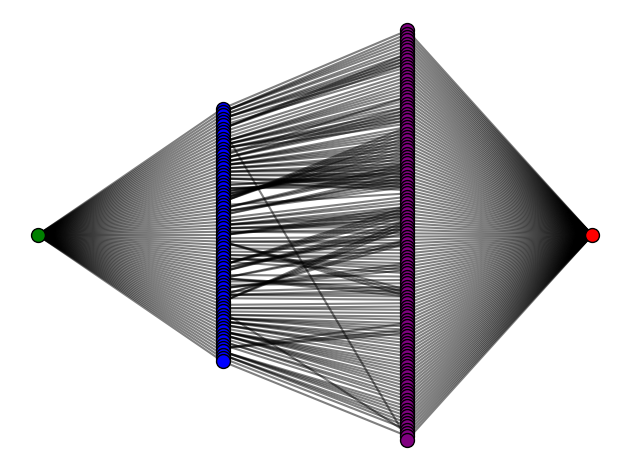

- written by: Nicolás López, Camilo Rocha and Jorge Finke

- last updated: Jun 27/2023

# Welcome to Allele Expression Consolidator's documentation!

Modules for consolidating expression information of an organism from the allele 
level to the gene level using an approach based on graph flow.

## Table of Contents

- [Module 1: alleleconsolidator](#module-1-alleleconsolidator)
  - [Graph flow](#graph-flow)
  - [Reference Paper](#reference-paper)
- [Module 2: test](#module-2-test)
- [API reference](#api-reference)

## Module 1: alleleconsolidator

This module contains the code for consolidating expression information
of an organism from the allele level to the gene level using an
approach based on graph flow.

The biological problem addressed with this software can be described as follows:

- Given a set of alleles and their expression values, and a set of
genes, find the corresponding expression values for each gene.

- The affinity between alleles and genes is given by the results of BLASTN, 
considering those pairs with an identity greater than 90% and a coverage
greater than 90%. Only the best 10 alignments are considered for each allele
or gene, according to the direction of analysis.


### Graph Flow

The assignment problem can be solved as follows:

1. Create a bipartite graph with the alleles as nodes of a first group, 
and the genes as nodes of a different group. The edges have a cost
associated to the affinity between the allele and the gene. The capacity 
of each edge is 1. Since we are looking for the best assignment, the
cost is the inverse of the affinity (i.e. multiplied by -1).

2. Add a source node ('SS') connected to all the alleles with a capacity equal
to 1 (because each allele can be assigned to only one gene) and no cost.

3. Add a sink node ('ST') connected to all the genes with infinite capacity 
and no cost.

4. Compute the maximum flow of the graph from the source to the sink.

The following figure shows in green the source node, in blue the allele nodes,
in purple the gene nodes, and in red the sink node.




### Reference Paper

López-Rozo, N.; Ramirez-Castrillon, M.; Romero, M.; Finke, J.; Rocha, C.
*Gene Expression Datasets for Two Versions of the Saccharum spontaneum AP85-441 Genome*.
Data 2023, 8, 1. https://doi.org/10.3390/data8010001

## Module 2: test

This module contains a small routine for testing the alleleconsolidator 
functions. It can be used by calling it directly from the command line:

```bash
python3 test.py
```

*Note*: Include the files with `.py` extension in the folder you need 
to execute your code, for easy access.


## API Reference

The reference can be found online 
[here](https://ocinlr.github.io/allele-consolidator/) or as 
a pdf [here](docs/alleleexpressionconsolidator.pdf).
